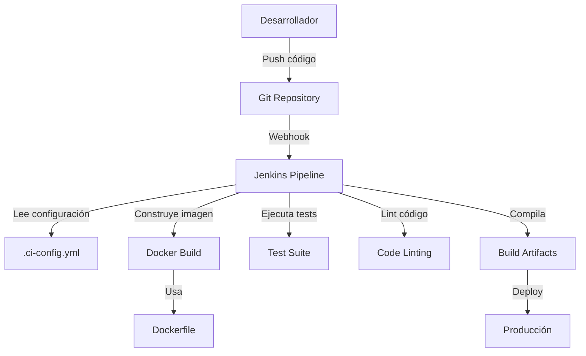
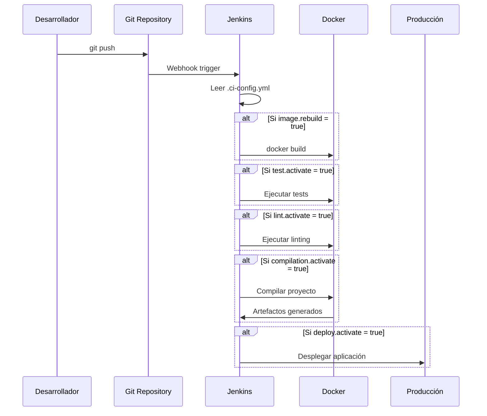

# Template CI/CD

Una plantilla completa para implementar pipelines de CI/CD utilizando Jenkins, Docker y configuración automatizada.

## 📋 Descripción

Este proyecto proporciona una plantilla lista para usar que permite implementar procesos de Integración Continua (CI) y Despliegue Continuo (CD) mediante Jenkins. La plantilla está diseñada para ser flexible y adaptable a diferentes lenguajes de programación y tipos de proyecto.

## 🏗️ Arquitectura del Sistema



## 📁 Estructura del Proyecto

```text
template-ci-cd/
├── config/                     # Configuraciones del CI/CD
│   ├── .ci-config.yml         # Configuración principal del pipeline
│   ├── Dockerfile             # Imagen Docker para el proyecto
│   └── Jenkinsfile           # Pipeline de Jenkins
├── nombreProyecto/            # Código fuente del proyecto
│   ├── src/                   # Código fuente
│   └── test/                  # Tests
├── .gitignore                 # Archivos ignorados por Git
├── LICENSE                    # Licencia MIT
└── README.md                  # Documentación
```

## ⚙️ Configuración

### 1. Configuración Principal (.ci-config.yml)

El archivo [config/.ci-config.yml](config/.ci-config.yml) contiene toda la configuración del pipeline:

```yaml
name: nombreproyecto                    # Nombre del proyecto
language: lenguaajedeprogramacion       # Lenguaje de programación

image:
  rebuild: false                        # Si reconstruir la imagen Docker
  workdir: config/Dockerfile           # Ruta al Dockerfile
  copy: ./nombreproyecto               # Directorio a copiar

test:
  activate: true                       # Activar tests
  command: "comando test"              # Comando para ejecutar tests

compilation:
  activate: true                       # Activar compilación
  command: "comando compilacion"       # Comando de compilación
  path: "/usr/src/nombreproyecto/target/release/" # Ruta de artefactos
  file: "archivo/s compilados"         # Archivos generados

deploy:
  activate: false                      # Activar despliegue

lint:
  activate: true                       # Activar linting
  command: "comando lint"              # Comando de linting

delete:
  activate: false                      # Limpieza de artefactos
```

### 2. Pipeline de Jenkins

El [config/Jenkinsfile](config/Jenkinsfile) utiliza una librería compartida para ejecutar el pipeline:

```groovy
@Library('SharedLibrary') _
Builder()
```

### 3. Contenedor Docker

El [config/Dockerfile](config/Dockerfile) define el entorno de ejecución:

```dockerfile
FROM ejemplo:latest
WORKDIR /usr/src/nombreproyecto
COPY ./nombreproyecto ./
CMD [""]
```

## 🚀 Flujo del Pipeline



## 📦 Uso de la Plantilla

### 1. Configuración Inicial

1. **Clonar la plantilla**:

   ```bash
   git clone <repository-url>
   cd template-ci-cd
   ```

2. **Personalizar la configuración**:
   - Editar [config/.ci-config.yml](config/.ci-config.yml) con los valores específicos de tu proyecto
   - Modificar [config/Dockerfile](config/Dockerfile) según las necesidades del proyecto
   - Actualizar el nombre del directorio `nombreProyecto/` por el nombre real

3. **Configurar Jenkins**:
   - Crear un nuevo pipeline en Jenkins
   - Configurar el webhook con tu repositorio Git
   - Asegurar que la SharedLibrary esté disponible

### 2. Personalización por Lenguaje

#### Para proyectos Python

```yaml
name: mi-proyecto-python
language: python

test:
  command: "python -m pytest"

compilation:
  activate: false  # Python no requiere compilación

lint:
  command: "flake8 ."
```

#### Para proyectos Java

```yaml
name: mi-proyecto-java
language: java

test:
  command: "mvn test"

compilation:
  command: "mvn package"
  path: "/usr/src/nombreproyecto/target/"
  file: "*.jar"

lint:
  command: "mvn checkstyle:check"
```

#### Para proyectos Rust

```yaml
name: mi-proyecto-rust
language: rust

test:
  command: "cargo test"

compilation:
  command: "cargo build --release"
  path: "/usr/src/nombreproyecto/target/release/"
  file: "mi-proyecto-rust"

lint:
  command: "cargo clippy"
```

## 🔧 Características

- ✅ **Pipeline automatizado** con Jenkins
- ✅ **Contenedorización** con Docker
- ✅ **Tests automatizados** configurables
- ✅ **Linting de código** integrado
- ✅ **Compilación** de artefactos
- ✅ **Despliegue continuo** opcional
- ✅ **Configuración flexible** mediante YAML
- ✅ **Soporte multi-lenguaje**

## 🛠️ Requisitos

- Jenkins con pipeline plugin
- Docker instalado en el agente de Jenkins
- SharedLibrary configurada en Jenkins
- Repositorio Git con webhooks configurados

## 📄 Licencia

Este proyecto está licenciado bajo la Licencia MIT. Ver [LICENSE](LICENSE) para más detalles.

## 🤝 Contribución

Las contribuciones son bienvenidas. Por favor:

1. Fork el proyecto
2. Crea una rama para tu feature (`git checkout -b feature/AmazingFeature`)
3. Commit tus cambios (`git commit -m 'Add some AmazingFeature'`)
4. Push a la rama (`git push origin feature/AmazingFeature`)
5. Abre un Pull Request

## 📞 Soporte

Si tienes preguntas o necesitas ayuda, puedes:

- Abrir un issue en el repositorio
- Consultar la documentación de Jenkins
- Revisar la configuración de la SharedLibrary

---

**Nota**: Recuerda personalizar todos los valores de ejemplo (`nombreproyecto`, `lenguaajedeprogramacion`, etc.) con los valores reales de tu proyecto antes de usar esta plantilla.
